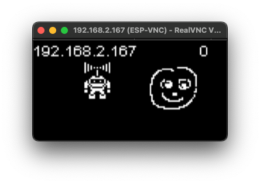

# Minimalistic VNC-Server for ESP32 and SSD1306 OLED
VNC server for ESP32 with SSD1306 OLED

Shows basic principle of how to do an VNC server to allow connection and control of OLED image.
Board: ESP32 (used TTGO WiFi & Bluetooth Battery OLED)

See https://www.hackerspace-ffm.de/wiki/index.php?title=VNC_Server_Protokoll_verstehen (German) for more information about implementing a minimalistic VNC server.

## Software Requirements
* Arduino 1.8.x
* ESP32 Arduino core from https://github.com/espressif/arduino-esp32
* OLED display driver from https://github.com/ThingPulse/esp8266-oled-ssd1306

